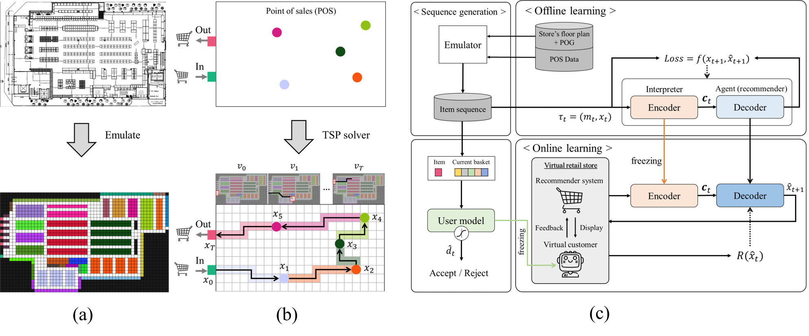
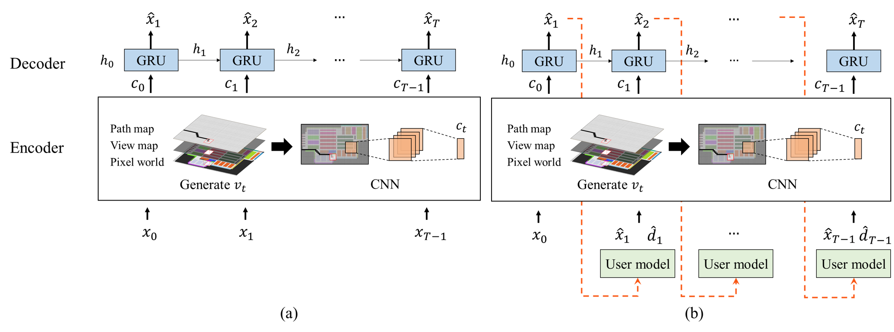

# gamification_offrec

### Overview

This paper has been 'accepted' to **SIGKDD2022**.

**Note: we found the wrong description in our paper (In section 3.6 (p. 6)). The decision of user model on the recommended items (which is determined by the decision-making function pretrained in offline learning) is greedy with 80% probability and random with 20% probability. And decision making function of the user model was set not to follow the A* algorithm but to follow TSP solver. Please refer to this for your clear understanding.**

**Title** : Recommendation in Offline Stores: A Gamification Approach for Learning the Spatiotemporal Representation of Indoor Shopping

We proposed a gamification approach wherein an actual store is emulated in a pixel world and the recurrent convolutional network (RCN) is trained to learn the spatiotemporal representation of offline shopping.  
Our work and method are illustrated below in Figure.



(a) : Illustrating pixel world that emulates floor plan of real-world offline retail store on scale  
(b) : Creation of item sequence and video stream, connecting the entrance and exit in the shortest path.  
(c) : Proposed Framework of recommender system for offline store

### Training Procedure


(a) Offline learning for spatiotemporal-awareness, (b) Online learning for interactive training

### Interaction between recommender system and virtual customer (user model) in the pixel world

Every time step _t_, the user model receives recommended item by the recommender system and decides whether accept or reject it. To recommend a specific item, the Recommender system considers their past movement and view around the current location of the user model. The figure below shows the example of interaction between the recommendation system pre-trained through offline learning and the user model in the pixel world. Through this process, interactive training is performed.

<p align="center"></p>

```diff
! Yellow stars represent the location of items that are planned to purchase.
@@ Blue stars represent the location of recommended item that are accepted. @@
- Red dot represents the current location of the user model.
# Black dots represent the past movement of the user model.
```

### Implementation

- **Environment**
  - os : Ubuntu 18.04
  - Python >= 3.7
- **Dependency**
  - Pytorch >= 1.7 (our developement environment)
  - pandas
  - numpy
  - json
  - ortools [1]
  - mlxtend [2,3]
  - tqdm (if you need)
  - datetime (if you need)
  - matplotlib (for plotting)
  - IPython (for plotting)

```bash
root
├─PHASE0_Data_preprocess
│   ├─ A_star.py
│   ├─ data_generation.py
│   ├─ frequent_items_mining.py
│   ├─ image_map_generator.py
│   └─ sequence_generator.py
├─PHASE1_Offline_learning
│   ├─ train.py
│   ├─ eval.py
│   ├─ dataloader.py
│   ├─ utils.py
│   └─ model.py
├─PHASE2_1_User_model
│   ├─ train.py
│   ├─ eval.py
│   ├─ dataloader.py
│   ├─ utils.py
│   └─ model.py
├─PHASE2_2_Online_learning
│   ├─ train.py
│   ├─ eval.py
│   ├─ env.py
│   └─ utils.py
├─Data
└─Saved_file
```

- **Offline learning**

  - **Data preparation**  
    In the `/Data/2021_SEQ` folder, trajectories extracted from POS data are already ordered by TSP solver.  
    We performed offline learning after creating pairs of video frames and item labels through an emulator for the efficiency of training.  
    Default setting : view range and maximum length of trajectories are set as 3 and 20, repectively.  
    Move to `/PHASE0_Data_preprocess` folder and Run below code to create pairs of video frames and item labels. (In our experience, It took about 20 minutes for each file to be converted.)

  ```bash
  python data_generation.py --mapG='y' --view=3 --maxlen=20 --sdx="train1"
  ```

  The created data will be located in `/Data/2021_MAP` folder.

  - **Training**  
    Note : GPU can be utilzed and default gru number is '0'.  
    Hyper-parameters :  
    **_CNN_** : output dimmension (odim), padding size (pad), kernel size (ker), stride (std), max pooling kernel size (mpker)  
    **_GRU_** : hidden dimmension (gruhd), the number of layer (gruly), dropout (grudp)  
    **_Other_** : learning rate (lr), batch size(bth), epoch size(ep)  
    Move to `/PHASE1_Offline_learning` folder and Run below code to train the model. For hyper-parameter tunning, please add `--(hyperparameter)= (value)` behind below code.

  ```bash
  python train.py --maxlen=20 --gpu="gpu_number" --save="folder-path" --bth=1024 --ep=100
  ```

  The training report will be created in `/Saved_file/RCN_model/(save:folder-path)` folder.

  - **Validation**  
    Run below code to valid or test the trained model from `/Saved_file/RCN_model/(save:folder-path)` folder. You can select validation mode either 'valid' or 'test'. Validation report will be created in the same folder.

  ```bash
  python eval.py --mode="test" --save="example" --bth=1024 --gpu='0'
  ```

- **User model's decision-making function**

  - **Data preparation**  
    To simulate and reproduce customers' general shopping behaviors inside the store, we train the model using the trajectories which contain **frequent itemsets**. The frequent itemset is extracted by the FPgrowth algorithm [3]. We set the number of different frequent itemsets (topN) as 30, and the number of items (len) contained in each itemset as 3. The minium value of support is set as 0.0001. In addition, fake sequences were created by randomly shuffling items from whole trajectories.  
    Move to `/PHASE0_Data_preprocess` folder and Run below code to extract trajectories and fake sequences for training the user model's decision-making function.

  ```bash
  python frequent_items_mining.py --minsup=0.0001 --len=3 --topN=30
  ```

  The datasets which contain the extracted trajectories and fake seqences will be created in `/Data/Dataset_usermodel`. The type of the datasets is `JSON`.  
  Note : **\*frequent itemset** is defined as the `topN=30` frequent patterns whose each pattern only consists of `len=3` items\*

  - **Training**  
    This function is implemented based on a Multi-layer perceptron (MLP) network containing an embedding layer. you can modify the size of embedding dimension (emdim) adding `--embed=(value)` behind below code. If you want to modify the structure of MLP, please move to `/PHASE2_1_User_model/model.py` and modify it in the way you want. This implementation code includes the process of stacking items.  
    Move to `/PHASE2_1_User_model` folder and Run below code to train the model.

  ```bash
  python train.py --gpu="gpu_number" --save="folder-path" --bth=1024 --ep=2000 --emdim=32 --lr=0.00001
  ```

  The training report will be created in `/Saved_file/User_model/(save:folder-path)` folder. Additionally, datasets not used for training will be stored in `/Data/Dataset_usermodel/Testset_usermodel` folder for validation.

  - **Validation**  
    Run below code to test the user model from `/Saved_file/User_model/(save:folder-path)` folder. Validation report will be created in the same folder.

  ```bash
  python eval.py --save="example" --bth=1024 --gpu='0'
  ```

- **Online learning**
  - **Training**  
    In the `/Saved_file/RCN_model/exmaple` folder and `/Saved_file/User_model/exmaple` folder, pre-trained networks through offline learning and user model exist for reproduction. If you perform offline learning or/and training for user model, you should change `RECSYS_MODEL_PATH (RPATH)` or/and `USER_MODEL_PATH (UPATH)`.  
    Considering sales operations, we design a reward function that control the recommender system to decrease the length of shopping (LOS) and to increase the total purchase of items (TPP). According to `lambda_`, the degree of control will be changed. `epsilon` is the probability that user model makes a random dicision.
    Move to `/PHASE2_2_Online_learning` folder and Run below code to perform online learning. Training report and updated `GRU` will be created and stored in `/Saved_file/Online_learning/(save:folder-path)`.
  ```bash
  python train.py --RPATH="example" --UPATH="example" --save="example" --lambda_=0.5 --seed=2022 --lr=0.0005 --gpu="gpu_num" --ep=500 --epsilon=0.2
  ```
  - **Validation**  
    For quatitative evaluation, we calculate and report Acceptance ratio, LOS, TPP and cross-entropy loss (XE-loss).  
    Run below code to evaluate the model in `/Saved_file/Online_learning/(save:folder-path)` folder. Validation report will be created in the same folder.
  ```bash
  python eval.py --save="example" --seed=2022 --gpu="gpu_num" --epsilon=0.2
  ```

## Reference

 [1] https://developers.google.com/optimization/routing/tsp  
 [2] http://rasbt.github.io/mlxtend/  
 [3] https://dl.acm.org/doi/10.1145/335191.335372
